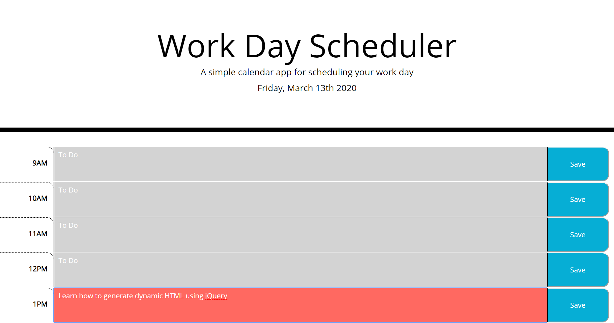

# Work Schedule Project

## Application link: 
**https://fmiusov.github.io/homework-5-calendar/**

## Why It Doesn't Work
See comments in script.js file. My biggest mistake was misunderstanding the route to take for the assignment, ie generating the html dynamically via jQuery and then running those values through functions and loops as necessary. 

The majority of my time was spent trying to resolve issues created by hardcoding the HTML. On the morning it was due, I learned of my mistake and spent that afternoon trying to do the homework again from the beginning, this time with the correct dynamic html. After several hours with no significant progress, I was left with one version with decent logic but bad html, and another version with only a few lines of jquery. The product you see is what I was able to salvage from my original attempt, as it contains more content.  

## Gallery

